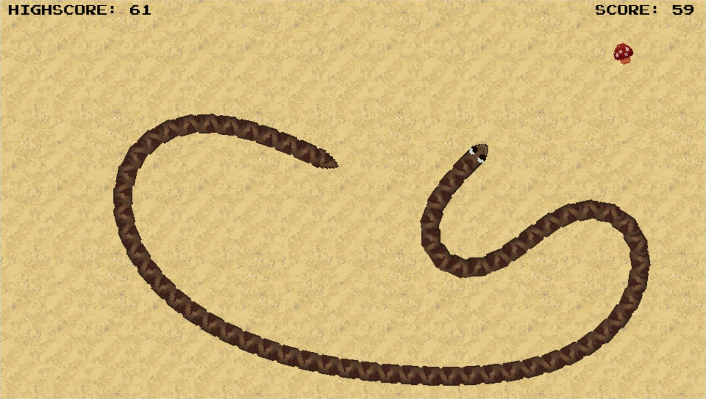
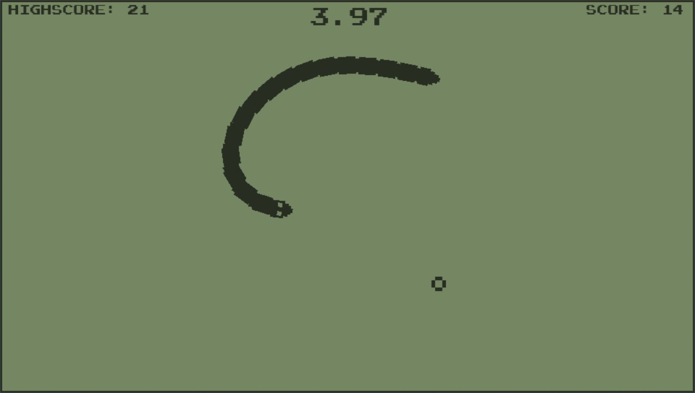

# vitaSnake
A snake game with smooth rotation made for the PS Vita with LibVita2D.  
Turn left and right to collect as many apples as you can, but avoid biting your tail, or you will lose the game.

See the official trailer here https://youtu.be/nMOkPak8w-4

# Screenshots

# Controls
* Use the left stick, DPAD or touch to control the snake
* Hold X to boost your speed
* Press START to pause the game

# Releases
[Get the latest release here](https://github.com/Grzybojad/vitaSnake/releases)  

# To Do
I'm very happy with how vitaSnake turned out. You may see a small update, but nothing major.